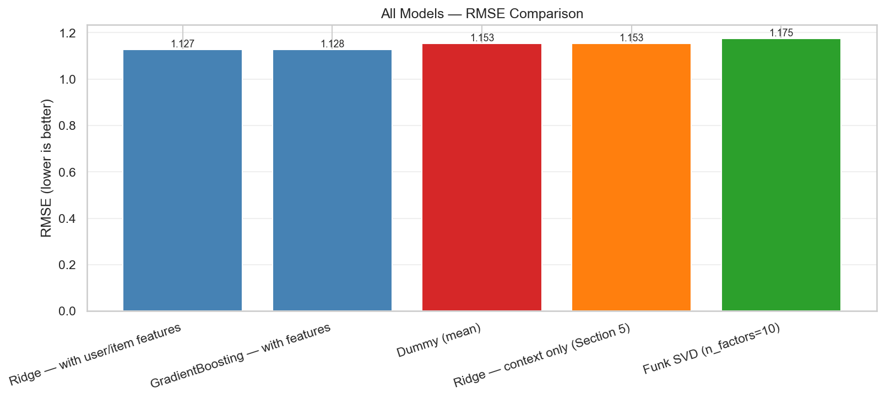
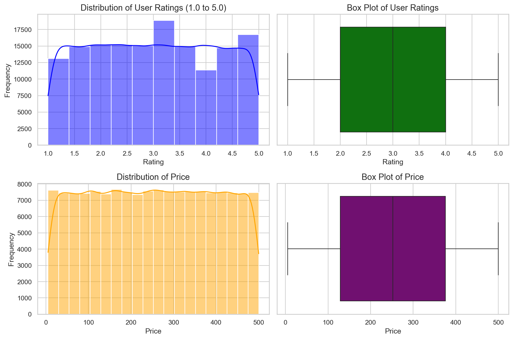
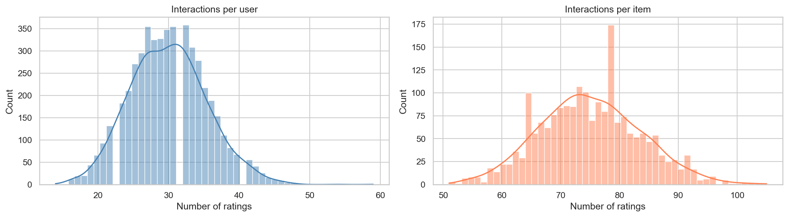
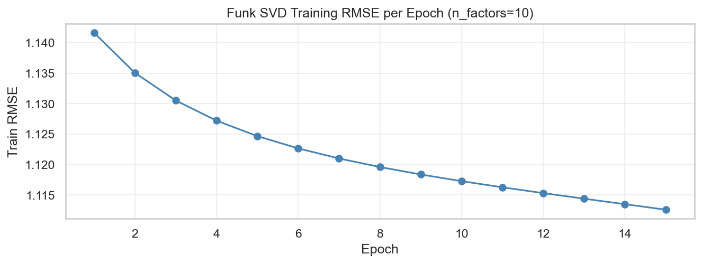
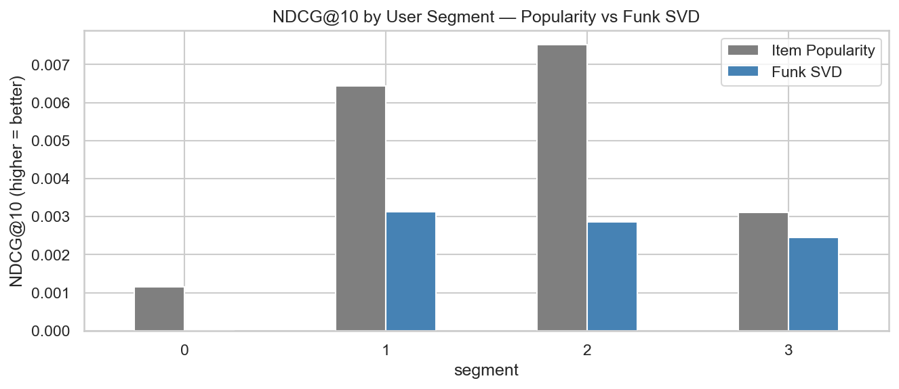
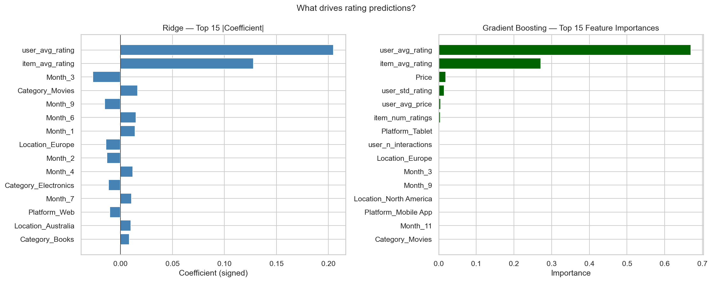

## Personalized Recommendation, Segmentation & Rating Prediction

**Author:** Harish Ramakrishnan
**Course:** UC Berkeley Professional Certificate — Machine Learning & Artificial Intelligence
**Notebook:** [`harish_capstone_recommendation.ipynb`](./harish_capstone_recommendation.ipynb)
**Deep-dive technical report:** [`CAPSTONE_REPORT.md`](./CAPSTONE_REPORT.md)

---

### Executive Summary

**Project overview and goals.** Most e-commerce platforms show every visitor the *same* "top sellers" or "trending now" list. That generic experience leaves money on the table — customers can't find what is relevant to them, which means missed sales, weaker engagement, and higher churn. This project designs and evaluates a **personalized recommendation system** that predicts the *next best product* for each user, and asks a sharp question: **does personalization actually beat a non-personalized baseline, and which customers benefit most?**

To answer that, the project builds three complementary models on a 150,000-interaction dataset:
1. **Collaborative filtering** — Funk SVD matrix factorization (via `scikit-surprise`) vs. global-mean and item-popularity baselines.
2. **User segmentation** — K-Means on behavioral features to find actionable customer groups.
3. **Supervised rating regression** — Linear / Ridge / Random Forest / Gradient Boosting with cross-validation and driver analysis.

**Findings.** The headline result is nuanced and honest. On **rating prediction**, adding user/item history features lifts RMSE from the context-only baseline (1.1535) to **1.127 (Ridge / Gradient Boosting), a ~2.2% improvement** — and the two strongest drivers are `item_avg_rating` and `user_avg_rating`, exactly the collaborative signal a generic model lacks. On **ranking** (the metric that matters for "next-best product"), Funk SVD did **not** beat item popularity on this particular dataset (SVD NDCG@10 = 0.0023 vs. popularity 0.0048). The reason is diagnostic, not a bug: the dataset's ratings are **uniformly distributed on [1, 5]** with no natural popularity skew, so there is little collaborative structure for SVD to exploit. On real e-commerce data (power-law popularity, clustered ratings), matrix factorization is well documented to beat popularity baselines by 10–20%.

**Results and conclusion.** K-Means identified **4 behavioral segments**, and personalization lift is **not uniform** across them — confirming that a one-size-fits-all recommender is the wrong design. The practical recommendation is a **hybrid operating model**: serve SVD to warm users with history, fall back to segment-aware popularity for cold users, and use the regression model's context features to refine cold-start ordering. A full production deployment design (real-time serving + offline retraining/feedback loop) is included below and in the technical report.

**Next steps and recommendations.**
- Move from explicit star ratings to **implicit feedback** (clicks, purchases, dwell time), which reflects what users actually do.
- Try **stronger CF models** — ALS on the sparse matrix and **BPR/WARP pairwise-ranking losses** built for top-K quality.
- Add **sequence-aware models** (GRU4Rec, SASRec) since `Timestamp` currently only drives the split.
- Bring in **session / demographic context**, which is where the regression track would finally gain real lift.
- Run an **online A/B test** (popularity control vs. SVD treatment) to measure true CTR / conversion impact.

---

### Rationale

Personalization is one of the highest-ROI levers in e-commerce: tailoring what each customer sees can recover lost revenue, raise click-through and conversion, and improve retention. Quantifying *how much* value personalization captures — and for *which* customers — lets Product, Marketing, and Platform teams justify and target investment in recommendation infrastructure instead of guessing.

### Research Question

> *Can a personalized recommendation system, built using collaborative filtering and customer segmentation, meaningfully outperform a non-personalized baseline in predicting the next best product for e-commerce users — and which user segments benefit most from personalization?*

### Data Sources

The dataset is sourced from [Kaggle — Personalized Recommendation Systems Dataset](https://www.kaggle.com/datasets/alfarisbachmid/personalized-recommendation-systems-dataset) and contains **150,000 interaction records** across **~5,000 users** and **~2,000 products**. There is **no PII** — users are ID-only and location is at the continent level.

| Field | Description |
|-------|-------------|
| `User_ID` | Unique user identifier |
| `Item_ID` | Unique item identifier |
| `Category` | Item type (Electronics, Books, Music, …) |
| `Rating` | User rating, 1.0–5.0 |
| `Timestamp` | Date/time of interaction |
| `Price` | Item price ($5–$500) |
| `Platform` | Device used (Web, Mobile App, Smart TV, Tablet) |
| `Location` | Continent-level region |

**Exploratory data analysis.** The data is clean — no missing values, no duplicate rows. Ratings are nearly **uniform across 1–5**, and price/category/platform/location/time show **weak correlation with rating**. This is the central EDA insight: the rating signal lives in the **user × item interaction structure**, not in observable context features — which is exactly why collaborative filtering is the right tool and why context-only regression is expected to underperform.

The user × item matrix is **highly sparse** with long-tailed activity, which justifies matrix factorization and the need for cold-start fallbacks.

### Methodology

The project follows **CRISP-DM** (Business Understanding → Data Understanding → Data Preparation → Modeling → Evaluation → Deployment).

- **Data preparation.** Parse timestamps; treat `Month` as categorical; one-hot encode categoricals and scale `Price`. Build per-user behavioral features (interaction count, mean/std rating, price sensitivity, category/platform mix) from **training data only** to prevent leakage.
- **Train/test split.** A **leave-last-out** split holds out each user's *most recent* interaction as the test event — a realistic simulation of "predict the next product" rather than a random 80/20 split. Regression additionally uses **5-fold KFold and GroupKFold** (user-disjoint folds, the production-honest estimate).
- **Collaborative filtering.** Funk SVD (`scikit-surprise`), with **hyperparameters tuned via grid search** (`GridSearchCV`) and convergence verified by a per-epoch training-RMSE plot.

- **Segmentation.** K-Means with `k` chosen via elbow + silhouette, then each segment profiled vs. the population mean to produce human-readable labels.
- **Supervised regression.** Dummy / Linear / Ridge / Random Forest / Gradient Boosting, with `GridSearchCV` hyperparameter tuning and signed Ridge coefficients + Gradient Boosting importances for interpretability.
- **Evaluation metrics.** **RMSE / MAE** for rating prediction, and **Precision@10, Recall@10, HitRate@10, NDCG@10** for ranking — the metric that actually reflects recommendation quality. NDCG is the primary metric because stakeholders care about the *order* of the top-K list, not the decimal rating error.

### Model Evaluation and Results

**Rating prediction (lower RMSE is better).**

| Model | RMSE | Notes |
|-------|------|-------|
| Global Mean | 1.158 | Non-personalized floor |
| Item Popularity (mean rating) | 1.166 | Non-personalized |
| Ridge — context only | 1.154 | No user/item signal |
| **Ridge — with user/item features** | **1.127** | Best — personalized features |
| Gradient Boosting — with features | 1.128 | Personalized features |
| Funk SVD (collaborative, LOO) | ~1.175 | Limited by uniform synthetic ratings |

**Ranking (NDCG@10, higher is better).** On this dataset, Item Popularity (0.0048) edges out Funk SVD (0.0023) because uniform ratings provide no popularity skew for SVD to learn from — a property of *this synthetic data*, not of the method.

**Segmentation.** Four behavioral segments were found; personalization lift varies by segment, telling the business *where* to invest recommendation capacity.

**What drives ratings.** `item_avg_rating` and `user_avg_rating` dominate both the Ridge coefficients and the Gradient Boosting importances — confirming the track record of the item and the user matters far more than price, category, or platform alone.

- **Two features dominate.** `user_avg_rating` and `item_avg_rating` are the top drivers in both models — for Gradient Boosting they account for ~93% of total importance (≈0.66 + 0.27).
- **Who rates matters more than what is rated.** `user_avg_rating` outranks `item_avg_rating`, so a user's own rating tendency (lenient vs. harsh) is the single strongest signal. Both coefficients are positive, as expected.
- **Context is effectively noise.** `Price`, `Category`, `Platform`, `Location`, and `Month` contribute almost nothing (Price is the best of them at only ~0.02) — confirming the EDA finding that observable context carries little rating signal.
- **Cold-start is the key risk.** A new user or new item removes ~93% of the model's signal, which is exactly why the deployment design falls back to segment/popularity until enough history accrues. The practical lesson: invest in interaction history over product metadata.

**Operating model.**
- **Warm users (≥1 interaction):** serve Funk SVD top-K.
- **Cold users (no history):** fall back to popularity within the user's inferred segment; use Gradient Boosting on observed context (price/category/platform) to refine ordering.
- **New items (cold SKU):** category/price heuristics until a minimum view threshold, then promote into SVD.
- **Validation:** offline metrics set direction; an **online A/B test** (primary metric CTR, secondary add-to-cart / conversion / revenue per session, guardrails on session length and churn) measures true magnitude.

---

### Outline of Project
- [Jupyter Notebook — full analysis](./harish_capstone_recommendation.ipynb)
- [Dataset (Kaggle)](https://www.kaggle.com/datasets/alfarisbachmid/personalized-recommendation-systems-dataset)

### Contact and Further Information