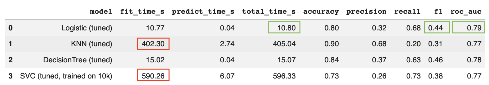
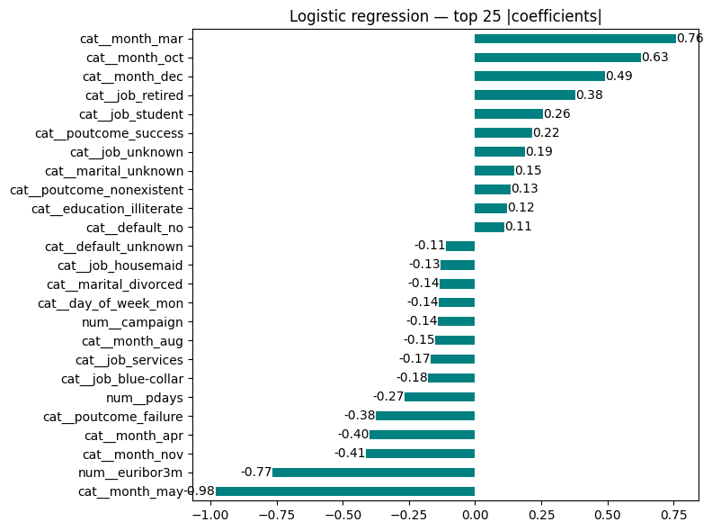

# README.md

## Data Source
The dataset comes from the UCI Machine Learning repository [link](https://archive.ics.uci.edu/ml/datasets/bank+marketing). The data is from a Portugese banking institution and is a collection of the results of multiple marketing campaigns between May 2008 and November 2010.

## Business Objective
Predict **long-term deposit subscription** (y) using the available numerical and categorical attributes so the bank can **prioritize** the **right contacts** to **optimize spend** and maximize **subscriptions**.

## Findings and Recommendations for Long-Term Deposit Subscription
This project focused on predicting long-term deposit subscriptions using various machine learning models and refining the feature set based on exploratory data analysis (EDA) insights. The goal was to help the bank prioritize the right contacts to optimize spend and maximize subscriptions.

### 1. Model Performance Comparison & Selection

After evaluating Logistic Regression, K-Nearest Neighbors (KNN), Decision Tree, and Support Vector Machines (SVM), the **Logistic Regression model emerged as the most favorable choice.**

*   **Logistic Regression**: Achieved an ROC-AUC of 0.79 and demonstrated excellent efficiency with a fit time of approximately 11 seconds. It offered the best balance of predictive power and computational speed, indicating strong ability to rank the probability of a subscription.
*   **Decision Tree**: A close second with an ROC-AUC of 0.78 and a fit time of 15 seconds. While its F1-score was slightly higher, its overall interpretability and robustness were considered less ideal compared to Logistic Regression for this specific problem.
*   **KNN & SVM**: Deemed less practical due to significantly higher training and prediction times (402s and 590s respectively) without providing substantial performance gains that would justify the increased computational cost.

### 2. Addressing EDA Concerns & Feature Engineering
Initial EDA of the Numerical and Categorical features revealed several points of concern:

*   **Duration**: The `duration` feature was identified as leading to data leakage (as it's only known after a call is performed), and was therefore **dropped** from the feature set.
*   **Numerical Outliers**: Features like `Campaign`, `pdays`, and `previous` showed skewed distributions and potential outliers. These were implicitly handled by applying `StandardScaler` during preprocessing, which is suitable for models sensitive to feature scaling.
*   **'Unknown' Categories**: Categorical features like 'default' had a significant percentage of 'unknown' values (e.g., 21% in 'Default'). `OneHotEncoder` was used, which effectively treats 'unknown' as its own category, allowing the model to learn from this information.
*   **Multicollinearity**: High correlation was observed among social and economic context attributes (`emp.var.rate`, `cons.price.idx`, `cons.conf.idx`, `nr.employed`, `euribor3m`). To address this, the Logistic Regression model was retrained using **only `euribor3m`** as the representative economic indicator, dropping the others.

### 3. Key Influential Features (Logistic Regression Coefficient Interpretation)

An analysis of the Logistic Regression coefficients revealed the following key insights into factors influencing term deposit subscriptions:

*   **Month of the Year (Seasonality)**:
    *   **Positive Impact**: March, October, and December were strongly associated with higher subscription rates.
    *   **Negative Impact**: May, November, and April showed lower subscription rates.
    *   **Recommendation**: Marketing campaigns should be strategically aligned with these seasonal trends, concentrating efforts during high-performing months and adjusting strategies for low-performing periods.
*   **Euribor 3-Month Rate (`euribor3m`)**:
    *   **Counter-Intuitive Negative Impact**: Surprisingly, `euribor3m` showed a negative correlation with subscription probability. This suggests that as interest rates increase, the likelihood of subscribing to a term deposit through this marketing channel decreases.
    *   **Recommendation**: Further investigation is required to understand this phenomenon. Possible reasons include: (a) dataset anomaly, (b) customers preferring alternative investment vehicles during high-interest periods, or (c) customers subscribing via different channels.
*   **Outcome of Previous Marketing Campaign (`poutcome_success`)**:
    *   **Positive Impact**: Clients who had a `successful` outcome from a previous campaign were significantly more likely to subscribe. This highlights the value of repeat engagement and customer satisfaction.
    *   **Recommendation**: Prioritize outreach to clients with a history of successful engagements.
*   **Job Category (`job_retired`, `job_student`)**:
    *   **Positive Impact**: Retired individuals and students showed a higher propensity to subscribe to long-term deposits.
    *   **Recommendation**: Tailor marketing messages and product offerings specifically for these demographics, emphasizing the benefits of secure, fixed-return investments for their financial situations (e.g., risk-averse for retirees, savings for students).

### 4. Business Recommendations

Based on the analysis, the following actions are recommended:

1.  **Optimize Campaign Timing**: Allocate marketing spend / resources to align with peak subscription months (March, October, December) and adjust strategies for lower-performing months.
2.  **Targeted Outreach**: Prioritize outreach to `retired` individuals and `students`, and clients with a `successful` history from previous campaigns.
3.  **Investigate `euribor3m` Anomaly**: Conduct deeper analysis into why a higher `euribor3m` rate negatively impacts subscriptions to term deposits via this specific channel. This could involve qualitative research or A/B testing different offers.
