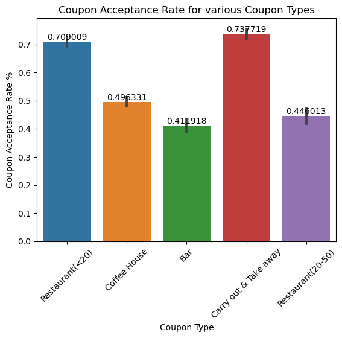

# EXPLORATORY DATA ANALYSIS ASSIGNMENT

### GOAL:
Using the provided Amazon Mechanical Turk Survey data on different driving scenarios, time of the day, weather, passenger information etc, we need to determine the answer 
for the primary question below.

```Primary Question : "Will a customer accept a Coupon?```

There are 3 possible answers:
* “Right away”
* “Later, before the coupon expires”
* “No, I do not want the coupon”

We need do a exploratory analysis on this data to determine which **features play a significant role** in determines whether a customer will accept the coupon or not. 

### BUSINESS USECASE:
Amazon wants to use this information to promote local businesses by presenting the `right coupon` at the `right time` to the `right customer` to maximize acceptance rate
and consequentially drive business for the coupon provider. So We need do a exploratory analysis on this data to determine which features play a significant role
in determines whether a customer will accept the coupon or not. 

### AVAILABLE DATA:
#### User Attributes: 
| Attribute                     | Possible Values                                                     |
| ----------------------------- | ------------------------------------------------------------------- |
| **Gender**                    | male, female                                                        |
| **Age**                       | below 21, 21–25, 26–30, etc.                                        |
| **Marital Status**            | single, married partner, unmarried partner, widowed                 |
| **Number of Children**        | 0, 1, more than 1                                                   |
| **Education**                 | high school, bachelor’s degree, associate’s degree, graduate degree |
| **Occupation**                | architecture & engineering, business & financial, etc.              |
| **Annual Income**             | less than $12,500; $12,500–$24,999; $25,000–$37,499; etc.           |
| **Bar Visits**                | 0, less than 1, 1–3, 4–8, greater than 8                            |
| **Takeaway Purchases**        | 0, less than 1, 1–3, 4–8, greater than 8                            |
| **Coffee House Visits**       | 0, less than 1, 1–3, 4–8, greater than 8                            |
| **Restaurant (< $20) Visits** | 0, less than 1, 1–3, 4–8, greater than 8                            |

#### Contextual Attributes: 
| Attribute                | Possible Values                                                                    |
| ------------------------ | ---------------------------------------------------------------------------------- |
| **Driving Destination**  | home, work, no urgent destination                                                  |
| **Location Information** | Map showing user, coupon, and destination with travel time and direction alignment |
| **Weather**              | sunny, rainy, snowy                                                                |
| **Temperature**          | 30°F, 55°F, 80°F                                                                   |
| **Time**                 | 10AM, 2PM, 6PM                                                                     |
| **Passenger**            | alone, partner, kid(s), friend(s)                                                  |

#### Coupon Attributes: 
| Attribute              | Possible Values |
| ---------------------- | --------------- |
| **Time Before Expiry** | 2 hours, 1 day  |

### ANALYSIS RESULTS: 

**Notebook Link:** https://github.com/Harish7882/UCB_ML_CLASS/blob/main/practical_applns/assignment5_1_starter/prompt.ipynb

##### Summary: 
The overall acceptance is 57% indicating a positive response signal from drivers towards the coupon program. Frequent visits to the place seems to have a positive effect on acceptance across all coupon types. Depending on type of coupon, other factors play a significant role on drivers accepting vs not. For e.g. Who is in the car with the driver also has an impact on the acceptance of `Bar` coupons: Driving with Kids have a -ve impact (20% acceptance) whereas having Friends has the highest probability of acceptance (57%). 

But as you can see in the below chart, Acceptance Rates can vary based on the Coupon Type. It looks like coupons for lower cost places tend to be accepted more than higher end places. This demands seperate analysis may need to be performed for each Coupon Type to determine what factors influence their acceptance rate.




#### Key Findings: 
As an exploration, I analyzed the data for two coupon types from the extreme ends of the acceptance range (Bar and Carryaway) to see what factors influence them. 

**Bar Coupon**

1. Bar Coupons have the lowest acceptance rates amoung all the coupon types (41%)
2. The # of times a customer visits the bar in a month has a very strong correlation to their acceptance rates: From 44% for Infrequent visitors to 78% for 4~8 times visitors. Drivers frequenting the Bars more than 3times a week have a very high acceptance rate (76%). The Acceptance Rate is still high even for drivers who visit Bars at least 1 time a month (68%).
3. As expected, Having Kids in the car has a very negative impact on acceptance as drivers with kids don't want to drink and drive.
4. Age has a slightly negative effect on acceptance. Younger drivers acceptance Bar Coupons more than the Older Drivers.
5. Income doesn't have any impact on the acceptance rate. There is no visible trend between Income and Acceptance.
6. People in `Production Occupations` and `Architecture & Engineering` have the highest acceptence rates (65+ %) compared to `Unemployed`, `Retired` or `Transportation Services` who have the lowest acceptance rates (Less than 30%).
7. A combination of these above factors (Like Age = 21, Traveling with Friends, and frequenting bars 3+ times a month) might have a cummulative effect on accepting Bar coupons.

**Carry out & Take away**

1. People working in high mobility demanding / non office type of jobs (`Protective Service`, `Construction & Extraction`, `Healthcare Practitioners & Technical`) are accepting "Carryout" coupons at a very high level (95% +) .
2. Who is in the Car doesn't seem to impact this category like it would for Bar coupons.
3. Similarly Income and Age has minimal impact on the rate  -- The conversion rates seems flat / uniform for all diff cohorts of Income or Age.
4. Hotter Weather has a better acceptance probability.
5. People are accepting coupons more during `Mid Afternoon` and `Evening` (over 80%) compared to early morning (66%) and mid morning (70%).
6. People are preferring coupons that has a longer expiry time window (1D validity over 2H validity).
7. "Widowers" are suprisingly accepting these coupons more (85%) than other cohorts - even Single people (75%).

### Next Steps: 
Similar analysis can be done for other coupon types to determine what fators play a role in their acceptance rates. Then we could think abt developing models for predicting acceptance for each of them and develop a recommender system on top of it to pick the best coupon to present to the driver for maximizing acceptance. 

